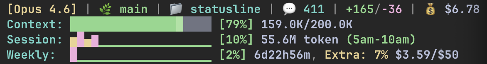

# statusline

[](https://github.com/usedhonda/statusline/actions/workflows/ci.yml)

Enhanced status line for Claude Code showing context usage, session time, and weekly budget.

## What it does



```
[Opus 4.6] | 🌿 main | 📁 statusline | 💬 249 | +24/-45 | 💰 $7.36
Context:    ████████▒▒▒▒▒▒▒▒▒▒▒▒ [49%] 98.4K/200.0K
Session:    █████▒▒▒▒▒▒▒▒▒▒▒▒▒▒▒ 1h34m/5h, 44.3M token(470K t/m) (3am-8am)
Weekly:     ████████████▒▒▒▒▒▒▒▒ [64%] 25m, Extra: 7% $3.59/$50
```

- **Line 1**: Model, git branch, directory, message count, lines changed, cost
- **Line 2**: Context window token usage with progress bar and cache ratio
- **Line 3**: Session time within 5-hour block, total tokens burned, burn rate
- **Line 4**: Weekly usage progress, extra usage %, cost vs budget

Supports **1M context** — the model bracket shows `(1M)` when using extended context.

## Key Features

### Context Window Monitoring
- Progress bar for token usage vs context window size (200K or 1M)
- Color-coded warnings: yellow at 70%, red at 90%

### 5-Hour Session Blocks
- Tracks time within 5-hour usage windows
- Shows burn rate (tokens/minute) and total tokens consumed
- Displays session time range (e.g., `3am-8am`)

### Weekly Budget Tracking
- Progress bar for weekly usage limits
- Extra usage percentage and cost vs budget display

### Responsive Layout
Automatically adapts to terminal width:
- **Full** (≥68 cols): All details with full labels
- **Compact** (35–67 cols): Abbreviated labels
- **Tight** (<35 cols): Ultra-minimal display

Also adapts to terminal height — switches to single-line minimal mode for short terminals.

### Agent Teams Support
When running as a Claude Code team agent, displays a single-line format with agent name, model, and usage. Includes dead agent warnings (`⚠️ DEAD: agent-name`) on the main terminal.

### Schedule Integration
Line 1 can swap with a calendar event display showing upcoming events with time-based urgency coloring.

## Installation

```bash
git clone https://github.com/usedhonda/statusline.git
cd statusline
python3 install.py
```

Restart Claude Code. Done.

## Requirements

- Python 3.9+
- Claude Code

## Configuration

### Display Options

Use `--show` to control which lines are displayed:
```bash
~/.claude/statusline.py --show all      # All 4 lines (default)
~/.claude/statusline.py --show simple   # Lines 2 and 3 only
~/.claude/statusline.py --show 1,2      # Specific lines
```

Or edit the top of `statusline.py`:
```python
SHOW_LINE1 = True   # Model / git / directory / cost
SHOW_LINE2 = True   # Context window usage
SHOW_LINE3 = True   # Session time / burn rate
SHOW_LINE4 = True   # Weekly usage / budget
```

### Environment Variables

```bash
export STATUSLINE_DISPLAY_MODE=full   # Force display mode (full/compact/tight)
export STATUSLINE_NO_COLOR=1          # Disable colors
export CLAUDE_PROJECTS_DIR="/path"    # Custom projects directory
```

Errors logged to `~/.claude/statusline-error.log`.
