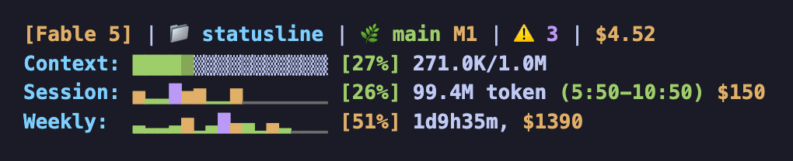

# ccsl

[](https://github.com/usedhonda/statusline/actions/workflows/ci.yml)
[](https://pypi.org/project/ccsl/)

Enhanced status line for Claude Code showing context usage, session time, and weekly budget.



```
[Opus 4.6] | 🌿 main | 📁 statusline | 💬 249 | +24/-45 | 💰 $7.36
Context:    ████████▒▒▒▒▒▒▒▒▒▒▒▒ [49%] 98.4K/200.0K
Session:    ▅█▃▁▂▄▁▁▁▁▁▁▁▁▁▁▁▁▁▁ [7%] 67.7M token (5am-10am)
Weekly:     ▅▃▁▇▂▇▁▁▄▁▆█▁▁▁▁▁▁▁▁ [42%] 3d0h24m, Extra: 7% $3.59/$50
```

## Install

```bash
brew install usedhonda/tap/ccsl
```

Restart Claude Code. Done.

<details>
<summary>Other install methods</summary>

**pip**

```bash
pip install ccsl
ccsl --setup
```

**From source**

```bash
git clone https://github.com/usedhonda/statusline.git
cd statusline
python3 install.py
```

</details>

## What it shows

- **Line 1** — Model, git branch, directory, message count, lines changed, cost
- **Line 2** — Context window token usage with progress bar and cache ratio
- **Line 3** — Session sparkline with 5-hour utilization, token count, and time range
- **Line 4** — Weekly sparkline with 7-day token distribution, remaining time, extra usage

Supports **1M context** — the model bracket shows `(1M)` when using extended context.

## Features

- Context window progress bar with color warnings (yellow 80%, red 90%)
- 5-hour session sparkline (20 segments, 15min each)
- Weekly usage sparkline with remaining time and budget tracking
- Responsive layout adapting to terminal width and height
- Agent team support with single-line format and dead agent warnings
- Schedule integration showing upcoming calendar events

## Customize

Control which lines to display:

```bash
ccsl --show all      # All 4 lines (default)
ccsl --show simple   # Lines 2 and 3 only
ccsl --show 1,2      # Specific lines
```

## Requirements

- Python 3.9+
- Claude Code
