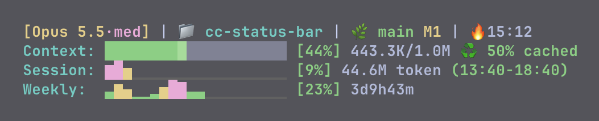

# ccsl

[](https://github.com/usedhonda/statusline/actions/workflows/ci.yml)
[](https://pypi.org/project/ccsl/)

Enhanced status line for Claude Code showing context usage, session time, and weekly budget.



```
[Opus 5.5·med] | 📁 cc-status-bar | 🌿 main M1 | 🔥15:12
Context: █████████▒▒▒▒▒▒▒▒▒▒▒ [44%] 443.3K/1.0M ♻️ 50% cached
Session: ▆█▃▁▁▁▁▁▁▁▁▁▁▁▁▁▁▁▁▁ [9%] 44.6M token (13:40-18:40)
Weekly:  ▃▆▄▁▁▂▅█▇▃▂▁▁▁▁▁▁▁▁▁ [23%] 3d9h43m
```

With a metered-billing model (e.g. Fable 5) Line 1 also carries the cost of the latest turn and extra-usage credit (`$7.36 | Ext 23% $11.50/$50`), and Lines 3–4 add each window's metered spend.

## Install

It's a single dependency-free Python file. Drop it in and point Claude Code at it:

```bash
mkdir -p ~/.claude
curl -fsSL https://raw.githubusercontent.com/usedhonda/statusline/main/statusline.py -o ~/.claude/statusline.py
python3 ~/.claude/statusline.py --setup
```

Restart Claude Code. Done — it keeps itself up to date automatically.

<details>
<summary>Other install methods</summary>

**pip**

```bash
pip install ccsl
ccsl --setup
```

**From source**

```bash
git clone https://github.com/usedhonda/statusline.git
cd statusline
python3 install.py
```

**Homebrew** (being retired — prefer the curl install above)

```bash
brew install usedhonda/tap/ccsl
ccsl --setup
```

</details>

## What it shows

- **Line 1** — Model with its reasoning effort (`·med`) and `⚡` in fast mode, directory, git branch, the open PR with its review state (`#17✓`), and the time the prompt cache goes cold (`🔥15:12`, `❄` once cold). Metered-billing models (e.g. Fable 5) add the cost of the latest turn and extra-usage credit consumption (Ext)
- **Line 2** — Context window token usage with progress bar and cache ratio
- **Line 3** — Session sparkline with 5-hour utilization, token count, time range, and the 5-hour window's metered spend
- **Line 4** — Weekly sparkline with 7-day token distribution, remaining time, the 7-day window's metered spend, extra usage

Built for **1M context** — the context line scales to the active window size (e.g. `443K/1.0M`). A `(200K)` badge on the model marks a 1M-capable model running with a reduced window.

## Features

- Metered-model cost tracking — models billed via usage credits (Fable 5) show what the latest turn cost, computed per-message so mixed-model sessions only count the metered share
- Context window progress bar with color warnings (yellow 80%, red 90%)
- 5-hour session sparkline (20 segments, 15min each)
- Weekly usage sparkline with remaining time and budget tracking
- Responsive layout adapting to terminal width and height
- Agent team support with single-line format and dead agent warnings
- Schedule integration showing upcoming calendar events

## Customize

Control which lines to display:

```bash
ccsl --show all      # All 4 lines (default)
ccsl --show simple   # Lines 2 and 3 only
ccsl --show 1,2      # Specific lines
```

Environment variables (set them in the `statusLine` command):

- `STATUSLINE_DISPLAY_MODE=full|compact|tight` — pin a layout instead of picking one from the terminal width. Handy in narrow tmux panes, where `full` keeps the long labels and trims the line ends
- `CCSL_KEEP_WARM_HOURS=N` — keep the prompt cache warm (off by default). A session that has been idle for less than N hours gets one tiny `[keep-alive]` turn typed into its tmux pane just before the cache expires, so the next real turn doesn't pay to re-cache the whole history. It only types into an empty prompt, and steps aside when CCStatusBar's own keep-warm is running

```json
"statusLine": {
  "type": "command",
  "command": "STATUSLINE_DISPLAY_MODE=full CCSL_KEEP_WARM_HOURS=4 ~/.claude/statusline.py --show all"
}
```

## Requirements

- Python 3.9+
- Claude Code
