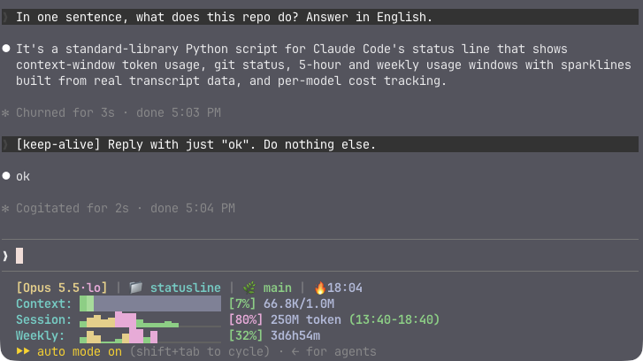

# ccsl

[](https://github.com/usedhonda/statusline/actions/workflows/ci.yml)

Enhanced status line for Claude Code showing context usage, session time, and weekly budget.


```
[Opus 5.5·med] | 📁 cc-status-bar | 🌿 main M1 | 🔥15:12
Context: █████████▒▒▒▒▒▒▒▒▒▒▒ [44%] 443.3K/1.0M ♻️ 50% cached
Session: ▆█▃▁▁▁▁▁▁▁▁▁▁▁▁▁▁▁▁▁ [9%] 44.6M token (13:40-18:40)
Weekly:  ▃▆▄▁▁▂▅█▇▃▂▁▁▁▁▁▁▁▁▁ [23%] 3d9h43m
```

With a metered-billing model (e.g. Fable 5) Line 1 also carries the cost of the latest turn and extra-usage credit (`$7.36 | Ext 23% $11.50/$50`), and Lines 3–4 add each window's metered spend.

## Install

It's a single dependency-free Python file. Drop it in and point Claude Code at it:

```bash
mkdir -p ~/.claude
curl -fsSL https://raw.githubusercontent.com/usedhonda/statusline/main/statusline.py -o ~/.claude/statusline.py
python3 ~/.claude/statusline.py --setup
```

Restart Claude Code. Done — it keeps itself up to date automatically.

<details>
<summary>Other install methods</summary>

**From source**

```bash
git clone https://github.com/usedhonda/statusline.git
cd statusline
python3 install.py
```

**pip / Homebrew (retired)** — these builds no longer receive updates. If you
installed with `pip install ccsl` or `brew install usedhonda/tap/ccsl`, switch to
the curl install above, then remove the old package (`pip uninstall ccsl` or
`brew uninstall ccsl`).

</details>

## What it shows

- **Line 1** — Model with its reasoning effort (`·med`) and `⚡` in fast mode, directory, git branch, the open PR with its review state (`#17✓`), and the time the prompt cache goes cold (`🔥15:12`, `❄` once cold). Metered-billing models (e.g. Fable 5) add the cost of the latest turn and extra-usage credit consumption (Ext)
- **Line 2** — Context window token usage with progress bar and cache ratio
- **Line 3** — Session sparkline with 5-hour utilization, token count, time range, and the 5-hour window's metered spend
- **Line 4** — Weekly sparkline with 7-day token distribution, remaining time, the 7-day window's metered spend, extra usage

Built for **1M context** — the context line scales to the active window size (e.g. `443K/1.0M`). A `(200K)` badge on the model marks a 1M-capable model running with a reduced window.

## Features

- Metered-model cost tracking — models billed via usage credits (Fable 5) show what the latest turn cost, computed per-message so mixed-model sessions only count the metered share
- Context window progress bar with color warnings (yellow 80%, red 90%)
- 5-hour session sparkline (20 segments, 15min each)
- Weekly usage sparkline with remaining time and budget tracking
- Responsive layout adapting to terminal width and height
- Agent team support with single-line format and dead agent warnings
- Schedule integration showing upcoming calendar events

## Customize

Control which lines to display:

```bash
~/.claude/statusline.py --show all      # All 4 lines (default)
~/.claude/statusline.py --show simple   # Lines 2 and 3 only
~/.claude/statusline.py --show 1,2      # Specific lines
```

Environment variables (set them in the `statusLine` command):

- `STATUSLINE_DISPLAY_MODE=full|compact|tight` — pin a layout instead of picking one from the terminal width. Handy in narrow tmux panes, where `full` keeps the long labels and trims the line ends
- `CCSL_KEEP_WARM_HOURS=N` — keep the prompt cache warm while a session sits idle (off by default). See [Prompt cache keep-warm](#prompt-cache-keep-warm)

```json
"statusLine": {
  "type": "command",
  "command": "STATUSLINE_DISPLAY_MODE=full CCSL_KEEP_WARM_HOURS=4 ~/.claude/statusline.py --show all"
}
```

## Prompt cache keep-warm

**Every turn sends the same thing: your whole conversation.** What changes is
the price per token, and that depends on whether the API still remembers it.

- **Cache warm** — the API has already processed the earlier part of the
  conversation and kept it in its prompt cache. Re-reading it costs about
  **0.1×** the normal input price (less on some models).
- **Cache cold** — the API has forgotten it. The whole history is processed
  again and written back into the cache at **2×** the normal input price.

On a Claude subscription the cache is forgotten **1 hour** after it was last
used. The `🔥HH:MM` on Line 1 is when that happens; `❄` means it already has.

Keep-warm sends one tiny turn shortly before that time. The turn re-reads the
cache, which resets the 1-hour timer.



**Example.** A 300K-token conversation on a model priced at $5/MTok input. You
step away and come back two hours later:

| | Without keep-warm | With keep-warm |
|---|---|---|
| Hour 1 | nothing — the cache goes cold | poke: 300K read at 0.1× ≈ $0.15 |
| Hour 2 | nothing | poke ≈ $0.15 |
| Your next turn | 300K written at 2× ≈ **$3.00** | 300K read at 0.1× ≈ $0.15 |
| Total | **$3.00** | **$0.45** |

**The rule of thumb: one cold start costs about as much as 20 pokes** (2× ÷ 0.1×).
Both sides send the same tokens, so the ratio doesn't depend on context size.
A bigger conversation only makes both sides more expensive, not the ratio.
(In small conversations the poke's own few output tokens start to show, so the
ratio drops a little; the amounts there are cents.)

Pokes happen at most once an hour. If you come back within a few hours,
keep-warm is far cheaper. If you walk away and never return, the pokes are pure
cost. `N` in `CCSL_KEEP_WARM_HOURS=N` caps that: after N hours without a real
prompt from you, pokes stop. On a subscription the same trade-off applies to
your usage limits instead of dollars.

**Enable it**

```json
"statusLine": {
  "type": "command",
  "command": "CCSL_KEEP_WARM_HOURS=4 ~/.claude/statusline.py --show all"
}
```

- Works in **tmux** and **iTerm2**. The first poke from iTerm2 asks for macOS
  Automation permission. Other terminals are skipped: they can't read the screen
  back, so there's no way to tell an empty prompt from a half-written one
- Only types into an empty prompt, and never twice for the same cache expiry
- The setting applies to every session that uses this `statusLine` command.
  For per-session control, use CCStatusBar; when its own keep-warm is running,
  the status line steps aside

## Requirements

- Python 3.9+
- Claude Code
